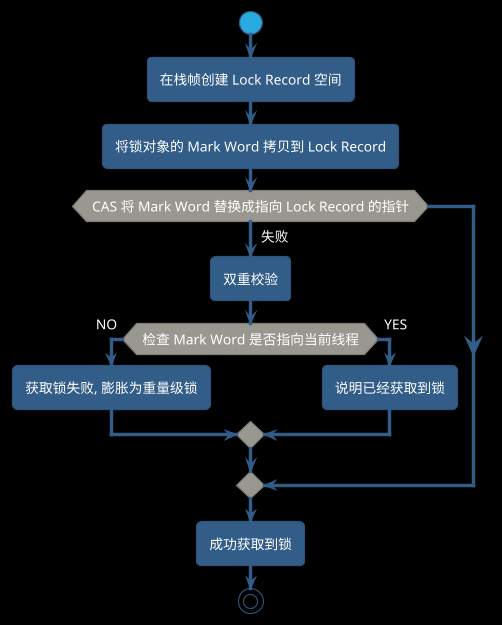

---
{"dg-publish":true,"dg-permalink":"synchronized 的升级过程","permalink":"/synchronized 的升级过程/"}
---

JDK 1.6 之后对synchronized进行了优化，使其更加的轻量化，提升性能。因此存在升级的过程：

## 轻量级锁

```plantuml
@startuml  
!theme sandstone  
skinparam backgroundColor #000000  
scale 1.1
  
start  
:在栈帧创建 Lock Record 空间;  
:将锁对象的 Mark Word 拷贝到 Lock Record;  
  
if (CAS 将 Mark Word 替换成指向 Lock Record 的指针) then (失败)  
    :双重校验;  
    if (检查 Mark Word 是否指向当前线程) then (NO)  
        :获取锁失败, 膨胀为重量级锁;  
    else(YES)  
        :说明已经获取到锁;  
    endif  
endif  
:成功获取到锁;  
stop  
@enduml
```